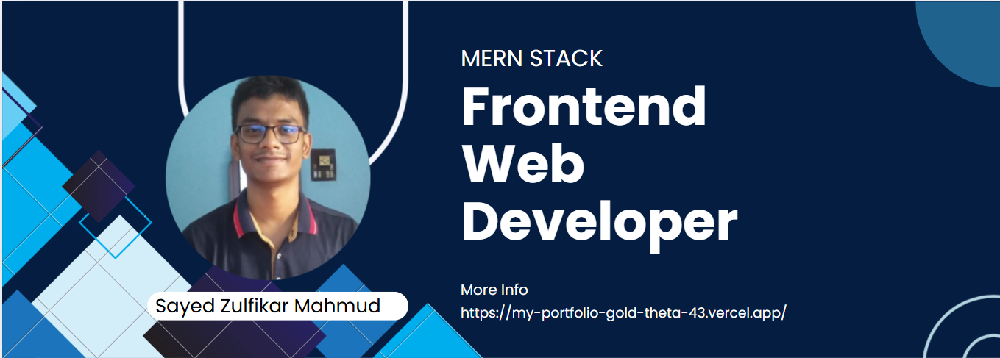

# 💫 About Me:

I am [Sayed Zulfikar Mahmud](https://my-portfolio-gold-theta-43.vercel.app/), a Full-Stack Developer based in Dinajpur, Bangladesh. My expertise centers on building scalable, efficient, and user-centric web applications. While I have a strong foundation in the MERN stack, I have specialized in the **Laravel ecosystem**, leveraging its power to deliver robust backend solutions. I am passionate about crafting elegant code, optimizing database performance, and creating seamless, reactive user interfaces. I am continuously evolving my skills to stay at the forefront of modern web development.

## 🌐 Socials:

   

# 💻 Tech Stack:

### Backend & Frameworks

     

### Frontend & UI

   

### Databases & Tools

   

# 🎦 My Projects

### 🚀 Production Project: Mabrur Hut

- 🌐 [Live Site](https://mabrurhut.com)

### 🚀 Project Name: HomeHunt

- 🌐 [Live Site](https://home-hunt-frontend.vercel.app/admin)
- 💻 [Frontend Code](https://github.com/zulfikar2022/home-hunt-frontend)
- 🔧 [Backend Code](https://github.com/zulfikar2022/home-hunt-backend)

### 🚀 Project Name: Best Bikes

- 🌐 [Live Site](https://coruscating-bonbon-3879b6.netlify.app/)
- 💻 [Frontend Code](https://github.com/zulfikar2022/assignment-4-frontend)
- 🔧 [Backend Code](https://github.com/zulfikar2022/assignment-4-backend)

### 🚀 Project Name: Animalto Toyasium

- 🌐 [Live Site](https://venerable-halva-459ef0.netlify.app/)

# 📊 GitHub Stats:

 
 

---
